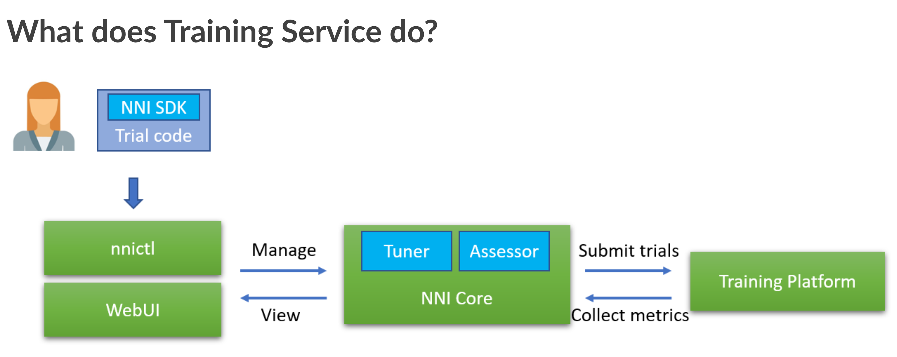
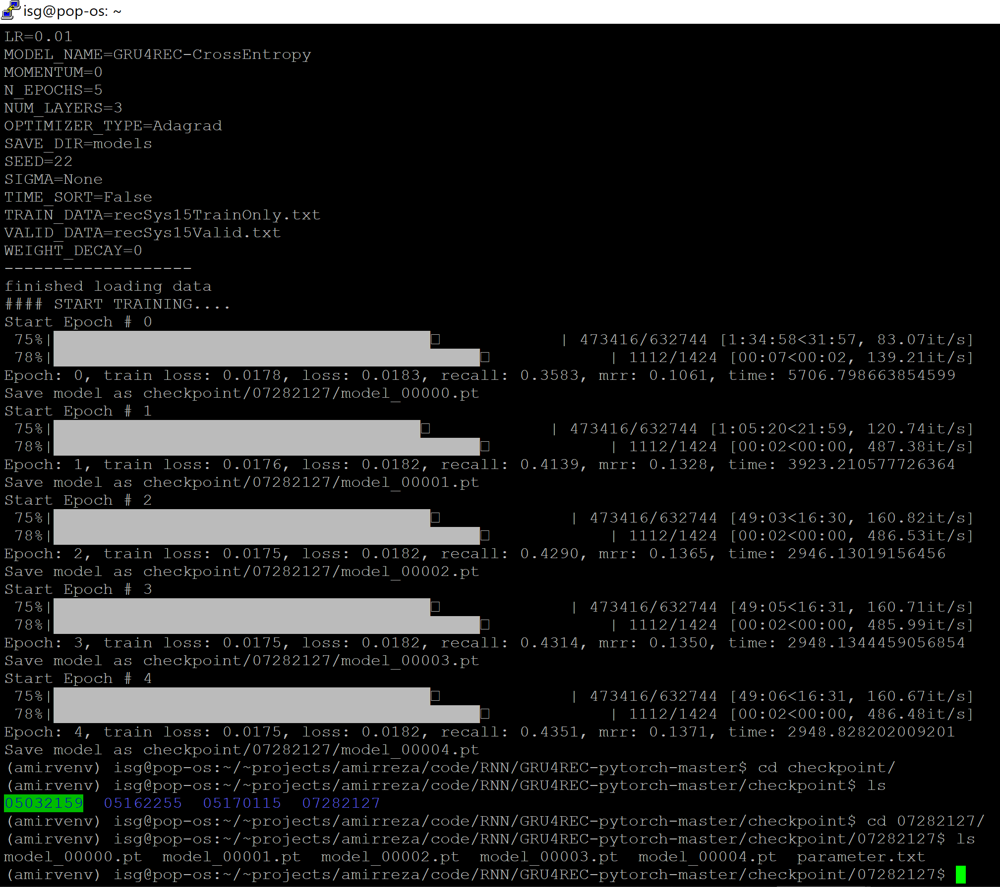

# Kaseb GRU4Rec Intent Forecaster 

  - Deep model based on Gated Recurrent Unit
  - Implemented in PyTorch 1.6


**Dataset** : The dataset is the YOOCHOOSE e-commerce dataset for RecSys 2015 Challenge consisting of 9.2 million user sessions. It contains the sequence of clicking events when the user is surfing on the e-commerce site. We work with the training set of the challenge and keep only the click events. We filter out sessions of length 1. Because of the nature of collaborative filtering methods, we filter out clicks from the test set where the item clicked is not in the train set. Sessions of length
one are also removed from the test set. After the preprocessing we are left with 15,324 sessions of
71,222 events for the test set.
* Each record/line in the file has the following fields: Session ID, Time stamp, item ID, Price, Quantity


**Goal** : The task is to predict for each session in the test file, whether there is going to be a buying event in this session, and if there is, what are the items that will be bought.


**Method** : sequential learning using recurrent methods with Gated Recurrent Unit (GRU) which is a simplified version of LSTM.


## Automated Approach 
session-based intent prediction systems using Recurrent Neural Networks (RNNs) are often built using off-the-shelf backbones such as GRU or various types of LSTMs. However, these architectures have numerous architecture hyper parameters, and therefore may not be naturally fit the data which may crucially effect the performance of the model. So here we used a automated approach for optimizing the parameters and architecture. To that end we used the recently released Microsoft AutoML framework, called NNI.
NNI (Neural Network Intelligence) is a lightweight but powerful toolkit to help users automate Feature Engineering, Neural Architecture Search, Hyperparameter Tuning and Model Compression.

<a href="nni-has-been-released"></a>

> Well known mega companies have recently started to give such automated services like: 
> * Google's Cloud AutoML was announced in January 2018
> * automated ML capability in Azure Machine Learning: September 24, 2018
> * Amazon’s AutoGluon: December 2019

### Installation

model requires [PyTorch](https://pytorch.org/) 1.3+ to run.

You can download the Dataset from [here](https://recsys.yoochoose.net/challenge.html).

Install the dependencies from requirements.txt and devDependencies and start the server.

```sh
$ cd kaseb-gru4rec-ai
$ python preprocessing.py
$ python main.py
```
## **NNI Installation**

### **Install**

NNI supports and is tested on Ubuntu >= 16.04, macOS >= 10.14.1, and Windows 10 >= 1809. Simply run the following `pip install` in an environment that has `python 64-bit >= 3.6`.

Linux or macOS

```bash
python3 -m pip install --upgrade nni
```

Windows

```bash
python -m pip install --upgrade nni
```

Note:

* If there is any privilege issue, add `--user` to install NNI in the user directory.
* Currently NNI on Windows supports local, remote and pai mode. Anaconda or Miniconda is highly recommended to install [NNI on Windows](docs/en_US/Tutorial/InstallationWin.md).
* If there is any error like `Segmentation fault`, please refer to [FAQ](docs/en_US/Tutorial/FAQ.md). For FAQ on Windows, please refer to [NNI on Windows](docs/en_US/Tutorial/InstallationWin.md#faq).

<a href="nni-has-been-released"></a>


## results
* Training loss is the error on the training set of data. Validation loss is the error after running the validation set of data through the trained network. Train/valid is the ratio between the two. Unexpectedly, as the epochs increase both validation and training error drop.
* mrr: Mean Reciprocal Rank is a measure to evaluate systems that return a ranked list of answers to queries.
* Recall: the fraction of the total amount of relevant instances that were actually retrieved.

<a href="nni-has-been-released"></a>


